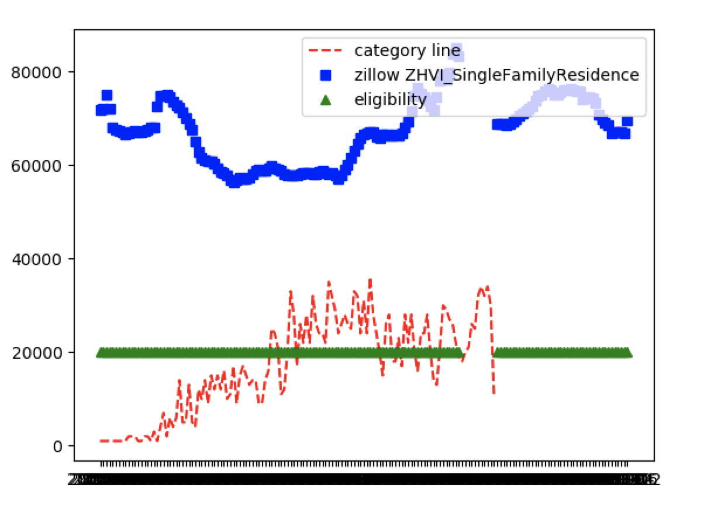

#### important data
```
Zillow_gentrification.csv 
path: drive/data/Zillow_gentrification.csv 
description: merge zillow data with gentrification eligibility data by year and zipcode, 5 zillow metrics have been chosen, all NA values have been removed. our baseline method is based on this data 
-----------------------------------------------------------------

Yelp_gentrification
formate1: sql table(year, zipcode, gentrification status, yelp review ids in this year and zipcode)
path: drive/data/yelp.db

formate2: json 
path: drive/data/yelp_merge_gentri_cache.json (key is year_zipcode)

descripion: merge yelp review data and gentrification data, our advanced method should base on this data 
-----------------------------------------------------------------

all_rev_ids.json
path: drive/data/
description: all the review ids could be found matched with gentrification data, do not extract features from review not in this cluster... it's not helpful in training models
------------------------------------------------------------------


```

#### environment setting before running code
```
#clone github to local, in terminal 
1. git init
2. git clone https://github.com/imyixiao/gentrification.git
3. cd gentrification

#set environment
conda env create -f ./new_env.yaml

#activate environmrnt
source activate new_env

#if you want to deactivate environment 
source deactivate new_env

#when you run functions, should activate environment
```

#### data preparation before running baseline_method
```
#get yelp sql database, could download from google drive, could also run script below, to run script, should download yelp dataset and unzip it, put it in path gentrification/yelp_data/
python3 transfer_json_to_sql.py

#get zillow sql database, run script, to run script, should download zillow dataset from kaggle and put them in path gentrification/zillow_data/
python3 transfer_csv_to_sql.py
```

#### run baseline_method, and get visualization result
```
python3 baseline_method.py
```




#### my folder structure
```
gentrification/
   code(my github repo)/
      baseline_method.py
      ...(all code)
      data/
         baseline_cache.json
         sql_cache.json
         gentrification_eligibility.csv
   yelp_data/
      business.json
      res.json
      review.json
   zillow_data/
      Zip_time_series.csv
      gentrifying_and_eligible_neighborhoods.csv
   yelp.db
   zillow.db
```

##### transfer_json_to_sql.py
```
script:
python3 transfer_json_to_sql.py

result:
res.json -> reconstruct business.json, key would be restaurant id, which will be used to retreive res info by review 
(sqlite table) review -> include review info and restaurant location information 
```

##### transfer_csv_to_sql.py
```
transfer zillow csv file to sql
```


##### variable_collections.py
```
all global variables, could be imported to different files
```

##### inside_boundary_checker.py
```
input: lat, lng, shp file
output: boolean, true if in boundary, false if not in boundary
```

##### retrieve_sql_database_functions.py
```
To satisfy different retrieval requirements (for example retrieve all restaurants in one zipcode, and etc), 
lots of functions would be created in this file to be used in the future.  
```

##### generate_visual_data_from_zillow.py
```
contains functions to satisify different data preparation requirements for visualization
```

##### baseline_method.py
```
baseline method code
```